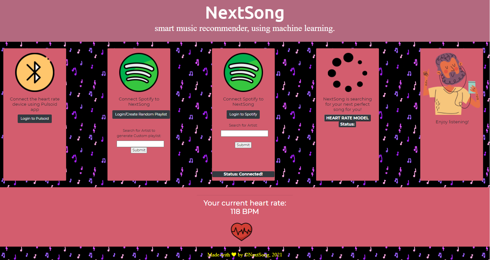

# NextSong- Smart Music Recommender Using ML 

Team:
Michal Moryosef, Abel Asfaw, Dor Ulman, Tenzin Sherpa

Welcome to NextSong! smart music recommender, using machine learning.

### Brief Background:
The goal of this project is to study how music affects heart rate variability and see how audio features affect our heart rate speed. This has both entertainment and health benefit.  
In the development of the product, NextSong used:
1. "CooSpo Heart Rate Monitor" to monitor heart rate.1 
2. Pulsoid - heart rate widget for live streams used to broadcast user's live heart rate to NextSong server and feed it later to the model.2
3. Spotify API for all music analysis 3
4. "musicnn"- an open source, deep learning-based music tagger, used as NextSong tansfer model 4

1 https://www.amazon.com/gp/product/B07R8741CN/ref=ppx_yo_dt_b_search_asin_title?ie=UTF8&psc=1  
2 https://pulsoid.net/  
3 https://developer.spotify.com/console/  
4 https://github.com/jordipons/musicnn, https://towardsdatascience.com/musicnn-5d1a5883989b

## Pre-Requisites To Run NextSong Locally:

#### Clone project

#### Running the pretrained model:
You have to create a virtual enviorement for this, we recommend using anaconda for this.
open anaconda,
then run the follwing

<code> Conda create —name myenv
Conda activate myenv
After that run the requirements txt
Make sure python is 3.7 not 3.8 </code>

#### Install the necessary Python packages

<code> $ pip install -r requirements.txt> </code>

#### Own a Spotify account to get the music recommendation playlist created directly to your account.
https://www.spotify.com

#### Export the environment variables

<code> $ export SPOTIFY_AUTHORIZATION_TOKEN=value_grabbed_from_spotify</code>

<code> $ export SPOTIFY_USER_ID=value_grabbed_from_spotify</code>

#### Have a Pulsoid app account in order to live stream your heart rate to the website
https://pulsoid.net/

#### In cloned project folder run the entry-point script in cmd/termial
<code> python app.py</code>

#### Download "musicnn" transfer model from GoogleDrive link below
(We could'nt attach it directly in this repo due to size limitations)
https://drive.google.com/drive/folders/1H9v07PqVAwPicbWGRxhDk3EQb3TY9VnF?usp=sharing

### NextSong Project Deck Sldes 
https://docs.google.com/presentation/d/1vv_OHbvcxyG1vmFbQ4ac_xXvftjzGMk01B1HucKkwiM/edit?usp=sharing

### Jupyer Notebook
Included in this repo, look for the .ipynb file.

